 

  

 

 

 

| 🎓 Education | 💼 Currently | 📍 Location |
|:---:|:---:|:---:|
| B.Tech in IT (2025) JD College of Engineering & Management, Nagpur | Job hunting 🎯 Frontend / Full-Stack roles | Surat, Gujarat, India 🇮🇳 |

 

> 🌈 I recently completed a **6-month internship at Keysoft Creation Pvt Ltd**, where I contributed to **KONTO** — a live, multi-client ERP system running in production. I love turning plain dashboards into vibrant, animated, glass-style interfaces.

 

 

 

 

<table>
<tr>
<td width="50%" valign="top">

### 🏥 KONTO
**Live production ERP** built during my internship — multi-client, multi-module architecture.

</td>
<td width="50%" valign="top">

### 📚 XBook
**Modular ERP/POS** with a dynamic grid engine and custom CQRS dispatcher.

</td>
</tr>
<tr>
<td width="50%" valign="top">

### 🏨 Hospital Management System
Full-stack HMS with JWT auth, role-based access & PostgreSQL backend.

</td>
<td width="50%" valign="top">

### 📊 Health Tracker Dashboard
Animated React dashboard, glass cards, gradient charts — Metric.IQ inspired.

</td>
</tr>
</table>

 

 

 

 

  

 

  
   
  ✨ Snake animates once the GitHub Action is added — happy to set that up too

 

Open to **Frontend & Full-Stack** opportunities — startups and MNCs alike. Let's connect!

